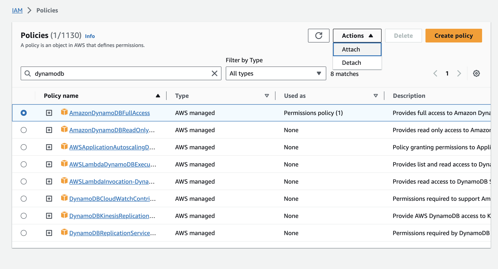
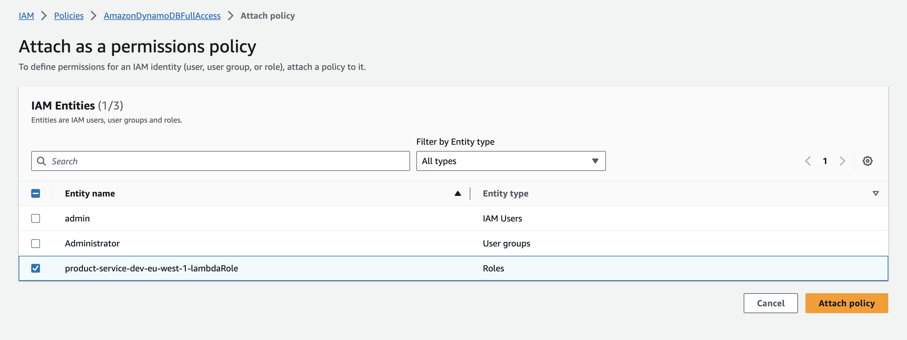

# aws-shop-be
This monorepo is the bucket for microservices utilized by the shop front-end app

## CLI - AWS
- install `brew install awscli`
- setup `aws configure`
- list config `aws configure list`
- get user info `aws iam get-user --user-name admin`
- list S3 buckets `aws s3 ls`
- scan DynamoDB table  
    ```
    aws dynamodb scan --table-name StoreProducts
    ```
- add/update DynamoDB item  
    ```
    aws dynamodb put-item --table-name StoreProducts --item '{ "id": { "S": "hello" }, "title": { "S": "world!" } }'`
    ```
- query  
    ```
    aws dynamodb query --table-name StoreProducts --key-condition-expression 'id = :id' --expression-attribute-values '{ ":id": { "S": "hello" } }'
    ```

## CLI - SLS
- create new service https://www.serverless.com/framework/docs/providers/aws/cli-reference/create  
    e.g. `sls create --template aws-nodejs --path product-service`
- create API Gateway https://www.serverless.com/framework/docs/providers/aws/events/apigateway  
    NOTE: v2, also called HTTP API, is faster and cheaper than v1 https://www.serverless.com/framework/docs/providers/aws/events/http-api  
    ```
    functions:
        simple:
            handler: handler.simple
            events:
            - httpApi: 'PATCH /elo'
        extended:
            handler: handler.extended
            events:
            - httpApi:
                method: POST
                path: /post/just/to/this/path
    ```
- serverless dotenv plugin https://www.serverless.com/plugins/serverless-dotenv-plugin
- invoke function https://www.serverless.com/framework/docs/providers/aws/cli-reference/invoke  
    e.g. `sls invoke local --function getProductsList`
- use variables https://www.serverless.com/framework/docs/providers/aws/guide/variables
- customize permisions for lambda functions https://www.serverless.com/framework/docs/providers/aws/guide/iam
- create resources https://www.serverless.com/framework/docs/providers/aws/guide/resources
- deploy to AWS: `sls deploy`

## Troubleshooting
- in case of 404 error complaining about that Lambda role is not authorized to perform e.g. `dynamodb:Scan` on some resource (table) then here's update needed
    
    

- in case of CORS errors e.g. when PUT to S3 bucket throws `CORS policy: Response to preflight request doesn't pass access control check: It does not have HTTP ok status` then bucket's CORS policy modification needed
    ```
        [
            {
                "AllowedHeaders": [
                    "*"
                ],
                "AllowedMethods": [
                    "POST",
                    "GET",
                    "PUT"
                ],
                "AllowedOrigins": [
                    "*"
                ]
            }
        ]
    ```
